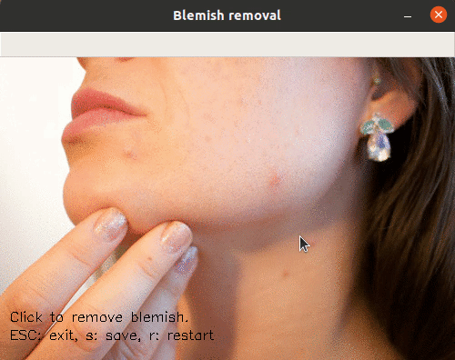

# Blemish removal
Simple blemish removal

With this program you can remove the blemish by simple clicking on the image. Then you can restart or save your results.

## Dependencies
* Python >= 3.6
  * [Download Python](https://www.python.org/downloads/)
* OpenCV >= 4.1
  * Ubuntu: [Install OpenCV-Python in Ubuntu](https://docs.opencv.org/master/d2/de6/tutorial_py_setup_in_ubuntu.html)
  * Fedora: [Install OpenCV-Python in Fedora](https://docs.opencv.org/master/dd/dd5/tutorial_py_setup_in_fedora.html)
  * Windows: [Install OpenCV-Python in Windows](https://docs.opencv.org/master/d5/de5/tutorial_py_setup_in_windows.html)
* Numpy >= 1.18
  * [Installing NumPy](https://numpy.org/install/)

## Basic execution
1. Clone this repo
2. Open the terminal in the top level directory
3. Run it: `python3 blemishRemoval.py`

In `blemishRemoval.py`, you can change the image in `image = cv2.imread("blemish.png", cv2.IMREAD_COLOR)` replacing `"blemish.png"` by your image path.
